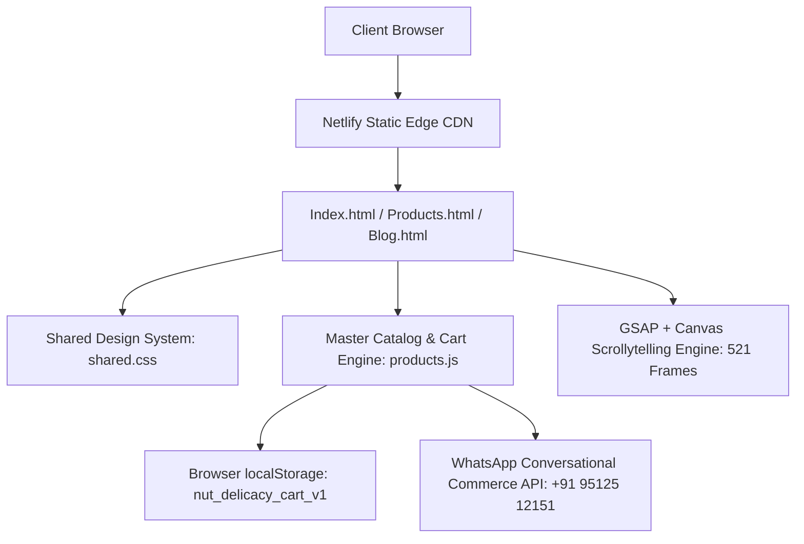
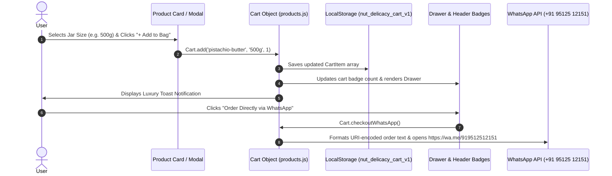

# Product Requirements Document (PRD)

---

## 1. Document Overview & Metadata

| Attribute | Specification Details |
| :--- | :--- |
| **Product Name** | **Njoy by Nut Delicacy** (*Nut Delicacy Artisanal Stone-Ground Nut Butters*) |
| **Domain / Canonical URL** | `https://nutdelicacy.in/` |
| **Document Version** | `v1.0.0 (Master Comprehensive Release)` |
| **Document Classification**| Complete Technical & Product Architecture Specification |
| **Primary Contact / Concierge** | WhatsApp: `+91 95125 12151` (`919512512151`) \| Email: `hello@nutdelicacy.com` |
| **Operational Base** | Surat, Gujarat, India |
| **Official Social Handles** | Instagram: [`@nut_delicacy`](https://www.instagram.com/nut_delicacy/) \| Facebook: [`Nut Delicacy Page`](https://www.facebook.com/profile.php?id=61593416630125) |
| **Target Platforms** | Mobile (iOS / Android), Tablet, Desktop (All Modern Web Browsers) |

---

## 2. Executive Summary & Brand Philosophy

### 2.1 Brand Narrative
**Njoy by Nut Delicacy** is a luxury Direct-to-Consumer (D2C) artisanal food brand specializing in 100% pure, single-origin organic nut butters and spreads. The brand eliminates industrial shortcuts—such as high-heat blade milling, hydrogenated palm oil, refined cane sugars, and artificial stabilizers—in favor of traditional cold granite stone-milling below 28°C.

### 2.2 Core Brand Manifesto
> *"Why Nut Delicacy? Because there are NO shortcuts."*
> 
> Real wellness and culinary indulgence should come directly from whole, honest nuts. 

* **❌ No Shortcuts:** No industrial emulsifiers, chemical stabilizers, or high-speed heat degradation.
* **❌ No Compromise:** Only single-origin whole organic nuts hand-selected from premier terroirs.
* **❌ No Added Sugar:** Natural sweetness derived solely from slow roasting or pure organic coconut blossom nectar.
* **❌ No Preservatives:** Free from artificial shelf-life extenders and artificial flavors.
* **❌ No Palm Oil:** 100% of the fats in every jar come directly from the whole roasted nuts.
* **✨ Just Pure Nuts. Nothing Else:** Handcrafted in small micro-batches and bottled in 100% recyclable glass jars.

### 2.3 Brand Taglines & Microcopy
* *“Real is Worth the Wait.”*
* *“Pure Ingredients. Real Joy.”*
* *“Single-Origin Stone-Ground.”*
* *“Cold Granite Milled Below 28°C Preserving Natural Vitality.”*

### 2.4 User Personas & Target Audience
1. **The Health & Wellness Connoisseur:** Fitness enthusiasts, keto/vegan dieters, clean-eaters, and parents seeking palm-oil-free, high-protein, heart-healthy superfoods.
2. **The Gourmet Foodie:** Epicures looking for ultra-premium single-origin spreads (e.g., Iranian/Sicilian Pistachio, Piedmont Hazelnut Gianduja) for sourdough pairings, artisanal breakfasts, and fine desserts.
3. **The Luxury Corporate & Wedding Gifting Buyer:** High-net-worth individuals and corporate procurement teams seeking bespoke tasting flights and luxury gift hampers.

---

## 3. System Architecture & Technical Stack



### 3.1 Technology Stack Matrix
* **Markup & Structure:** Semantic HTML5 (`index.html`, `products.html`, `blog.html`, `blog/*.html`).
* **Styling & Design System:** Custom Vanilla CSS3 Design Tokens in `shared.css` (zero external CSS framework dependencies).
* **Scripting & Business Logic:** Modern Vanilla JavaScript (ES6+) in `products.js`.
* **Animation & Scrollytelling:** GSAP 3.12.5 (`gsap.min.js`) + ScrollTrigger 3.12.5 (`ScrollTrigger.min.js`) controlling HTML5 `<canvas>`.
* **Media Assets:** WebP format images with fallback support (`.webp`, `.png`, `.jpg`).
* **Scrollytelling Frame Asset Pool:** 521 sequential high-resolution WebP frames split across two directories:
  * `images frame part-01/` (Frames 001 to 238)
  * `images frame part-02/` (Frames 001 to 283)
* **Local Development Server:** Python 3 multi-threaded HTTP server (`server.py`) serving with zero-cache headers on port `3000`.
* **Deployment & Edge Optimization:** Netlify (`netlify.toml`) with immutable long-term caching for animation frames and strict security headers.

### 3.2 Hosting & Edge Rules (`netlify.toml`)
* **Publish Directory:** `.` (root static delivery).
* **Build Command:** None required (pure zero-build static architecture).
* **Global Headers (`/*`):**
  * `X-Frame-Options = "DENY"`
  * `X-Content-Type-Options = "nosniff"`
  * `Referrer-Policy = "strict-origin-when-cross-origin"`
  * `Permissions-Policy = "camera=(), microphone=(), geolocation=()"`
* **Asset Cache Controls:**
  * `/images%20frame%20part-01/*` $\rightarrow$ `Cache-Control = "public, max-age=31536000, immutable"`
  * `/images%20frame%20part-02/*` $\rightarrow$ `Cache-Control = "public, max-age=31536000, immutable"`
  * `/*.jpg` & `/*.png` $\rightarrow$ `Cache-Control = "public, max-age=31536000, immutable"`
* **Redirects:** `/home` $\rightarrow$ `/` (301 Permanent Redirect).

---

## 4. Design System & UI/UX Specifications

### 4.1 Color Palette & Design Tokens (`shared.css`)

| Token Name | Hex / Value | Semantic Role |
| :--- | :--- | :--- |
| `--cream` | `#f7f1e5` | Primary warm background surface |
| `--paper` | `#efe4cf` | Secondary warm paper card surface |
| `--paper-light` | `#fbf7ee` | Tertiary subtle card background |
| `--brown` | `#2e1a11` | Primary brand deep roast typography & dark UI |
| `--brown-deep` | `#1d0f09` | Darkest contrasting brand tone |
| `--brown-light` | `#5f412e` | Secondary body text and subtitles |
| `--brown-muted` | `#8c735d` | Subtle metadata, borders, and timestamps |
| `--olive` | `#3f4b23` | Brand signature botanical green (primary CTAs) |
| `--olive-dark` | `#2c3617` | Hover states for primary buttons and dark accents |
| `--olive-light`| `#586932` | Highlights, active indicators, and focus rings |
| `--gold` | `#b38b47` | Luxury Reserve badges, primary accents, stars |
| `--gold-light` | `#d6af62` | Subtitle highlights, golden text accents |
| `--gold-soft` | `rgba(179,139,71, 0.15)` | Reserve pill backdrops |
| `--dark` | `#141b0d` | Deep forest dark cards (Manifesto, Newsletter) |
| `--white` | `#fffdfa` | Warm pure white for cards and modals |
| `--frame-bg` | `#bfbfbf` | 3D canvas studio matching background |
| `--glass-border`| `rgba(62,36,21, 0.12)` | Subtle glassmorphic borders |
| `--glass-bg` | `rgba(255,253,250, 0.88)`| Translucent glassmorphism panels |

### 4.2 Typography Hierarchy
* **Display / Editorial Headings (`h1`, `h2`, `h3`, `h4`, `.serif-font`, `.serif`):** `Fraunces`, Georgia, serif (Weight 500–700, Letter-spacing `-0.025em` to `-0.03em`, with font italicization `em` for brand emphasis).
* **Body / Interface UI (`body`, `input`, `button`, `nav`):** `Plus Jakarta Sans`, sans-serif (Weight 300, 400, 500, 600, 700, Line-height `1.6` to `1.75`).
* **Monospace HUD Elements:** `monospace` (Counter numbers: `001 / 521`).

### 4.3 Geometry, Shadows & Elevation
* **Border Radii:**
  * `--radius-xs`: `8px` (Size selector buttons)
  * `--radius-sm`: `14px` (Product cards, image wrappers)
  * `--radius-md`: `22px` (Ritual cards, modal cards, spotlight articles)
  * `--radius-lg`: `32px` (Manifesto flagship banners, newsletter signup)
  * `--radius-full`: `9999px` (Pills, badges, action buttons, search inputs)
* **Shadow Hierarchy:**
  * `--shadow-sm`: `0 4px 20px rgba(46, 26, 17, 0.05)`
  * `--shadow-md`: `0 12px 35px rgba(46, 26, 17, 0.08)`
  * `--shadow-lg`: `0 24px 60px rgba(44, 54, 23, 0.14)`
  * `--shadow-gold`: `0 10px 30px rgba(179, 139, 71, 0.25)`
* **Ambient Texture:** `.noise-overlay` fixed radial dot matrix at opacity `0.035` (`14px 14px` grid) across the viewport.

---

## 5. Information Architecture & Navigation

```
nutdelicacy.in/
├── index.html                           [The Experience - Homepage & 3D Scrollytelling]
├── products.html                        [The Collection - 10 Products, Filters & Modals]
├── blog.html                            [The Journal - Culinary & Wellness Guides]
├── blog/
│   ├── what-is-pistachio-butter.html                 [Featured Spotlight Guide]
│   ├── pistachio-butter-vs-peanut-butter.html        [Head-to-head Nutritional Analysis]
│   ├── what-does-stone-ground-nut-butter-mean.html   [The Granite Stone Ritual]
│   ├── benefits-of-organic-almond-butter.html        [Mamra Almond Superfood Guide]
│   ├── why-zero-palm-oil-matters.html                [Ingredient Purity Manifesto]
│   └── healthy-breakfast-ideas-nut-butter.html       [7 Gourmet Breakfast Toast Recipes]
├── netlify.toml                         [Edge Headers, Caching & Redirects]
├── robots.txt                           [Crawler Rules & Sitemap Link]
└── sitemap.xml                          [Complete XML Sitemap with Image Schemas]
```

### 5.1 Desktop Header Navigation (`#site-header`)
* **Logo:** Monogram avatar (`brand-logo.webp`) + Brand Wordmark (`Njoy by Nut Delicacy`).
* **Navigation Links:**
  * `The Experience` $\rightarrow$ `index.html`
  * `The Collection` $\rightarrow$ `products.html`
  * `Blog` $\rightarrow$ `blog.html`
  * `Our Manifesto` $\rightarrow$ `index.html#story`
  * `The Ritual` $\rightarrow$ `index.html#values`
  * `Contact` $\rightarrow$ `#contact`
* **Utility Actions:**
  * Instagram Link Icon (`https://www.instagram.com/nut_delicacy/`)
  * Facebook Link Icon (`https://www.facebook.com/profile.php?id=61593416630125`)
  * Shopping Bag Button: Shows dynamic badge count with trigger `Cart.openDrawer()`.
  * WhatsApp Direct CTA Button: Green `#25d366` button opening `https://wa.me/919512512151`.

### 5.2 Mobile Bottom Navigation Bar (`.mobile-bottom-nav`)
Positioned fixed at viewport bottom with backdrop blur for screens $\le 650\text{px}$:
1. **Home:** Icon + "Home" label (`index.html`).
2. **Collection:** Shopping bag outline icon + "Collection" label (`products.html`).
3. **Tasting Bag:** Cart icon with live badge counter + "Tasting Bag" label (`Cart.openDrawer()`).
4. **Journal:** Book icon + "Journal" label (`blog.html`).
5. **WhatsApp:** WhatsApp icon + "WhatsApp" label (`https://wa.me/919512512151`).

### 5.3 Global WhatsApp Floating Concierge Widget
* Fixed bottom-right round trigger button (`.whatsapp-concierge-btn`).
* Interactive pop-up card (`#whatsapp-concierge-popup`) with online status:
  * **Option 1 (Order):** `sendConciergeInquiry('order')` $\rightarrow$ Pre-filled WhatsApp message for placing/customizing an order.
  * **Option 2 (Gifting):** `sendConciergeInquiry('gifting')` $\rightarrow$ Pre-filled WhatsApp message for corporate/wedding gifting allocations.
  * **Option 3 (Tasting):** `sendConciergeInquiry('tasting')` $\rightarrow$ Pre-filled message for flavor pairings & single-origin flight advice.

---

## 6. Detailed Page-by-Page Specifications

### 6.1 Homepage (`index.html`) — The 3D Experience

```
+-----------------------------------------------------------------------------------+
|  [Header: Logo | The Experience | The Collection | Blog | Cart (0) | WhatsApp]   |
+-----------------------------------------------------------------------------------+
|                                                                                   |
|   [PAGE 1: FULLSCREEN CANVAS SCROLL-LINKED HERO SEQUENCE]                         |
|   • 521 High-Res WebP Frames rendered dynamically with 3D Studio Edge Blending    |
|   • Scrubbed over +=450% viewport scroll via GSAP ScrollTrigger                   |
|   • Synchronized Timed Floating Scrollytelling Headings (Steps 0 to 4)            |
|   • Real-Time Progress HUD [Scrubber Bar + Counter: 001 / 521]                   |
|   • Preloader Overlay with percentage counter & progress ring                     |
|                                                                                   |
+-----------------------------------------------------------------------------------+
|                                                                                   |
|   [PAGE 2: THE BRAND MANIFESTO & THE NJOY STORY]                                  |
|   • Dark Luxury Flagship Card: "Why Nut Delicacy? Because there are NO shortcuts."|
|   • 6 Manifesto Pillars Pills (No Shortcuts, No Sugar, No Palm Oil, Pure Nuts)    |
|   • Master Roaster's Flight: 4 Curated Reserve Cards (Pistachio, Gianduja, etc.)  |
|                                                                                   |
+-----------------------------------------------------------------------------------+
|                                                                                   |
|   [PAGE 3: THE STONE-GROUND RITUAL]                                               |
|   • 4 Pillars: 100% Organic, Zero Palm Oil, Cold Stone-Ground, Micro-Batches      |
|                                                                                   |
+-----------------------------------------------------------------------------------+
|                                                                                   |
|   [PAGE 4: HOMEPAGE FAQ & TRANSPARENCY]                                           |
|   • 4 Essential FAQs (Difference from store brands, Palm oil, Oil separation, etc)|
|                                                                                   |
+-----------------------------------------------------------------------------------+
|                                                                                   |
|   [PAGE 5: PRIVATE TASTING CLUB NEWSLETTER SIGNUP]                                |
|   • Dark Gradient Card: Email capture form with luxury toast confirmation         |
|                                                                                   |
+-----------------------------------------------------------------------------------+
|  [Footer: Brand Story | Collection Links | Journal Links | Concierge Coordinates] |
+-----------------------------------------------------------------------------------+
```

#### Detailed Scrollytelling Animation Stages (521 Total Frames)
* **Canvas Preloader (`#sequence-loader`):** Preloads initial frame immediately, displays live percentage (`0%` to `100%`), and auto-dismisses once minimum 30 frames are ready.
* **Canvas Edge Blending:** Features adaptive multi-stop linear gradients (`#bfbfbf` to `#dcdcdc` to `#efe4cf`) and soft edge feathering routines to eliminate hard frame borders on desktop and mobile.
* **Scroll-Linked GSAP Timeline (`#experience` pinned for `+=450%` scroll length):**
  * **Step 0 (`0% - 3%`):** Hero initial title $\rightarrow$ *"Single-Origin Stone-Ground: Real is Worth the Wait."*
  * **Step 1 (`18% - 36%`):** Side left $\rightarrow$ *"Artisanal Sourcing: 100% Single-Origin Whole Organic Nuts."*
  * **Step 2 (`42% - 60%`):** Side left $\rightarrow$ *"Cold Granite Milled: Stone-Ground Below 28°C Preserving Natural Vitality."*
  * **Step 3 (`65% - 82%`):** Side right $\rightarrow$ *"Zero Additives: No Added Sugar. Zero Palm Oil."*
  * **Step 4 (`86% - 98%`):** Side right finale $\rightarrow$ *"The Perfection of Njoy: Pure Ingredients. Real Joy."*

---

### 6.2 The Collection Page (`products.html`)

```
+-----------------------------------------------------------------------------------+
|  [Header: Logo | The Experience | The Collection | Blog | Cart (0) | WhatsApp]   |
+-----------------------------------------------------------------------------------+
|                                                                                   |
|   [COLLECTION HERO]                                                               |
|   • Eyebrow: Traditional Granite Stone-Ground                                      |
|   • Title: The Pure Nut Collection                                                |
|   • Subtitle: 100% Whole Organic Nuts, Stone-Ground Below 28°C                    |
|                                                                                   |
+-----------------------------------------------------------------------------------+
|                                                                                   |
|   [CATALOG FILTER TABS & DIETARY PILLS]                                           |
|   • Tabs: All Creations (10) | Grand Reserve (3) | Artisanal (4) | Classics (3)   |
|   • Badges: 100% Organic | No Palm Oil | Zero Sugar | Stone-Milled | Vegan & Keto |
|                                                                                   |
+-----------------------------------------------------------------------------------+
|                                                                                   |
|   [DYNAMIC PRODUCTS GRID - Desktop 3-Col / Mobile 2-Col]                          |
|   • Rendered dynamically from PRODUCTS array in products.js                       |
|   • Per-Card Size Switcher: [250g | 500g | 1kg] with instant price updates        |
|   • "+ Add to Bag" Quick-Add Button (opens Drawer & triggers Toast)               |
|   • "Details" Button / Card Image Click (opens Deep-Linked Product Modal)         |
|                                                                                   |
+-----------------------------------------------------------------------------------+
|                                                                                   |
|   [BRAND MANIFESTO BANNER & CATALOG FAQ GRID]                                     |
|   • 6-Pillar Credo Card + 4 Catalog FAQs (Oil separation, Ordering, Vegan, Shelf) |
|                                                                                   |
+-----------------------------------------------------------------------------------+
```

#### Product Card Anatomy
1. **Reserve Ribbon:** Gold pill badge (`Reserve`) on Grand Reserve items.
2. **Interactive Image Box:** Displays jar render on a radial cream background with hover zoom.
3. **Category Label:** Uppercase olive tag (e.g., `GRAND RESERVE EDITION`).
4. **Product Title:** Fraunces serif title (e.g., `Imperial Pistachio Butter`).
5. **Subtitle / Blend Ratio:** (e.g., `100% Royal Iranian & Sicilian Emerald Green Pistachios`).
6. **Origin Terroir:** Pin icon + Origin string (e.g., `Single-Origin Iranian & Sicilian Terroir`).
7. **Tasting Note Pills:** Display first 2 tasting notes (hidden on mobile for compact 2-column density).
8. **Size Selector Bar:** 3 selectable buttons (`250g`, `500g`, `1kg`) toggling active state and updating card price.
9. **Action Footer:** Dynamic Price in Indian Rupee format + `+ Add to Bag` + `Details` button.

#### Product Detail Modal Dialog (`#product-modal-backdrop`)
* Deep link supported via hash (e.g., `products.html#product-pistachio-butter`).
* **Left Column:** High-res jar render with subtle emerald/gold glow and `"🌿 100% PURE NO PALM OIL"` purity badge.
* **Right Column:**
  * Close Button (`✕`)
  * Category Badge + Title + Subtitle + Narrative Description
  * 4-Box Technical Spec Grid: **Single Origin**, **Texture**, **Roast Profile**, **Ingredients**
  * Tasting Notes Tags
  * 4-Box Nutritional Purity Table: **Calories**, **Protein**, **Healthy Fats**, **Dietary Fiber** per 100g
  * Modal Size Selector with dynamic price recalculation
  * Modal Quantity Stepper (`- [ 1 ] +`, bounded between 1 and 50)
  * Primary Action: `Add to Cart — ₹[Dynamic Total]`
  * Secondary Action: `Order on WhatsApp` (direct product payload)

---

### 6.3 The Journal / Blog Index (`blog.html`)
* **Hero Header:** *"Stories in Pure Nutrition & Craft."*
* **Spotlight Master Guide:** Large 2-column featured banner showcasing *What Is Pistachio Butter? The Connoisseur's Complete Guide*.
* **Articles Grid:** 5 secondary articles formatted as cards with category tags, descriptions, read durations, and hover zoom effects.

---

### 6.4 Editorial Articles (`blog/*.html`)
All 6 articles include Breadcrumbs, Author Byline (*Nut Delicacy Culinary Lab*), Publish Date (`August 16, 2026`), SEO Schema (`Article`, `BreadcrumbList`, `FAQPage`), and contextual CTAs linking directly to the product catalog and WhatsApp concierge:

| Article File | Headline & Topic | Key Nutrition / Focus |
| :--- | :--- | :--- |
| `what-is-pistachio-butter.html` | *What Is Pistachio Butter? The Connoisseur's Complete Guide* | Iranian & Sicilian Terroir, Lutein & Zeaxanthin, Chlorophyll pigments, Gelato & Toast pairings. |
| `pistachio-butter-vs-peanut-butter.html`| *Pistachio Butter vs Peanut Butter: Which Is Healthier?* | Comprehensive comparison table: Amino acids, Antioxidants, Monounsaturated fats, Calories. |
| `what-does-stone-ground-nut-butter-mean.html` | *What Does Stone-Ground Nut Butter Mean? The Granite Ritual* | Granite stone speed vs industrial blade heat ($>60^\circ\text{C}$ vs $<28^\circ\text{C}$), Enzyme retention. |
| `benefits-of-organic-almond-butter.html`| *The Connoisseur's Guide to Pure Almond Butter & Mamra Almonds* | Californian vs Kashmiri Mamra almonds, Vitamin E, Magnesium, Cellular energy. |
| `why-zero-palm-oil-matters.html` | *Why Zero Palm Oil & No Added Sugar Matter in Nut Butters* | Trans-fats in industrial spreads, natural oil separation science, Cardiovascular health. |
| `healthy-breakfast-ideas-nut-butter.html`| *7 Gourmet Breakfast & Toast Ideas with Artisanal Nut Butters* | Sourdough toasts, chia seed puddings, Greek yogurt parfaits, Gianduja brioche recipes. |

---

## 7. Master Product Catalog & Data Dictionary

All 10 products are defined in `products.js`. The complete data dictionary is detailed below:

```
+----------------------------------------------------------------------------------------------------+
|                                    10 MASTER PRODUCT CREATIONS                                     |
+----------------------------------------------------------------------------------------------------+
|  1. CLASSICS & INDULGENCE (3)                                                                      |
|     • Classic Peanut Butter [₹299 / ₹549 / ₹999]                                                   |
|     • Peanut Chocolate Spread [₹349 / ₹629 / ₹1,149]                                               |
|     • Peanut Dark Chocolate 70% [₹379 / ₹699 / ₹1,249]                                             |
|                                                                                                    |
|  2. ARTISANAL STONE-GROUND (4)                                                                     |
|     • Stone-Ground Almond Butter [₹599 / ₹1,099 / ₹1,999]                                          |
|     • Himalayan Walnut Butter [₹649 / ₹1,199 / ₹2,199]                                             |
|     • Walnut Almond Synergy Butter [₹629 / ₹1,149 / ₹2,099]                                        |
|     • Velvet Cashew Butter [₹549 / ₹999 / ₹1,849]                                                  |
|                                                                                                    |
|  3. GRAND RESERVE EDITION (3)                                                                      |
|     • Imperial Pistachio Butter [₹1,199 / ₹2,199 / ₹4,199] — Crown Jewel                           |
|     • Piedmont Hazelnut Butter [₹999 / ₹1,849 / ₹3,499]                                            |
|     • Hazelnut Dark Chocolate Spread [₹1,099 / ₹1,999 / ₹3,799] — Gianduja                         |
+----------------------------------------------------------------------------------------------------+
```

### 7.1 Exhaustive Product Specifications

#### Product 1: Classic Peanut Butter
* **ID:** `peanut-butter`
* **Category:** `classics` \| **Category Label:** `Classic Stone-Ground` \| **Badge:** `Bestseller`
* **Starting Price:** `₹299`
* **Subtitle:** 100% Slow-Roasted Saurashtra Bold Peanuts
* **Description:** Crafted from hand-selected, slow-roasted Saurashtra peanuts milled to perfection between granite stones. Natural oils remain intact for unmatched richness and authentic roasted aroma.
* **Origin Terroir:** Saurashtra, Gujarat (Single-Origin)
* **Ingredients:** 100% Roasted Organic Peanuts (No Added Sugar, No Hydrogenated Oil, Zero Salt)
* **Texture:** Velvety Smooth & Creamy \| **Roast Profile:** Medium Golden Roast
* **Pricing by Jar Size:**
  * `250g`: ₹299
  * `500g`: ₹549
  * `1kg`: ₹999
* **Nutrition per 100g:** Calories: `588 kcal` \| Protein: `26.0g` \| Healthy Fats: `50.0g` \| Carbs: `20.0g` \| Fiber: `8.5g` \| Sugar: `0.0g (Zero Added)`
* **Tasting Notes:** Deep Toasted Peanut, Naturally Sweet Undertones, Buttery Velvet Finish
* **Pairings:** Artisanal Sourdough Toast, Morning Banana Oats, Post-Workout Smoothies, Fruit Slices
* **Flags:** `isBestSeller: true`, `isReserve: false`

---

#### Product 2: Peanut Chocolate
* **ID:** `peanut-chocolate`
* **Category:** `classics` \| **Category Label:** `Classic Indulgence` \| **Badge:** `Connoisseur Choice`
* **Starting Price:** `₹349`
* **Subtitle:** Stone-Ground Roasted Peanuts with Pure Cacao
* **Description:** A decadent harmony of slow-milled roasted peanuts blended with natural cocoa powder and a hint of organic coconut blossom nectar. Clean, guilt-free indulgence without palm oil.
* **Origin Terroir:** Saurashtra Peanuts & Single-Origin Cacao
* **Ingredients:** Roasted Peanuts (85%), Pure Single-Origin Cacao (12%), Coconut Blossom Nectar (3%)
* **Texture:** Silky Chocolate Spread \| **Roast Profile:** Medium Dark Roast
* **Pricing by Jar Size:**
  * `250g`: ₹349
  * `500g`: ₹629
  * `1kg`: ₹1,149
* **Nutrition per 100g:** Calories: `572 kcal` \| Protein: `23.5g` \| Healthy Fats: `46.0g` \| Carbs: `24.0g` \| Fiber: `9.2g` \| Sugar: `3.2g (Natural Unrefined)`
* **Tasting Notes:** Warm Roasted Cacao, Nutty Chocolate Ganache, Subtle Caramel Aroma
* **Pairings:** Warm Croissants, Crepes & Pancakes, Berry Bowls, Espresso Dip
* **Flags:** `isBestSeller: true`, `isReserve: false`

---

#### Product 3: Peanut Dark Chocolate (70% Cacao)
* **ID:** `peanut-dark-chocolate`
* **Category:** `classics` \| **Category Label:** `Classic Indulgence` \| **Badge:** `70% Dark Blend`
* **Starting Price:** `₹379`
* **Subtitle:** Intense 70% Dark Cacao & Roasted Peanuts
* **Description:** Designed for dark chocolate purists. Bold, high-polyphenol dark cacao paired with slow stone-ground roasted peanuts. Rich, bittersweet, and packed with natural antioxidants.
* **Origin Terroir:** Indian Single-Origin Dark Cacao & Saurashtra Peanuts
* **Ingredients:** Roasted Peanuts (78%), 70% Single-Origin Dark Cacao Mass (20%), Pure Stevia Leaf (2%)
* **Texture:** Rich Truffle Texture \| **Roast Profile:** Bold Dark Roast
* **Pricing by Jar Size:**
  * `250g`: ₹379
  * `500g`: ₹699
  * `1kg`: ₹1,249
* **Nutrition per 100g:** Calories: `565 kcal` \| Protein: `24.2g` \| Healthy Fats: `47.5g` \| Carbs: `19.0g` \| Fiber: `11.0g` \| Sugar: `0.5g (Natural Trace)`
* **Tasting Notes:** Intense Dark Chocolate, Bittersweet Cacao Truffle, Roasted Peanut Finish
* **Pairings:** Dark Roast Espresso, Sourdough with Sea Salt, Protein Bowls, Gourmet Baking
* **Flags:** `isBestSeller: false`, `isReserve: false`

---

#### Product 4: Stone-Ground Almond Butter
* **ID:** `almond-butter`
* **Category:** `artisanal` \| **Category Label:** `Artisanal Single-Origin` \| **Badge:** `Pure Organic`
* **Starting Price:** `₹599`
* **Subtitle:** 100% Californian & Mamra Slow-Roasted Almonds
* **Description:** Milled at temperatures below 28°C on traditional stone grinders to preserve the essential Vitamin E, magnesium, and delicate monounsaturated fats. A silky texture with an intoxicating roasted almond perfume.
* **Origin Terroir:** California & Kashmiri Mamra Almonds
* **Ingredients:** 100% Slow-Roasted Whole Almonds (Zero Additives)
* **Texture:** Ultra-Silky Stone-Milled \| **Roast Profile:** Light Golden Roast
* **Pricing by Jar Size:**
  * `250g`: ₹599
  * `500g`: ₹1,099
  * `1kg`: ₹1,999
* **Nutrition per 100g:** Calories: `614 kcal` \| Protein: `21.5g` \| Healthy Fats: `53.0g` \| Carbs: `18.5g` \| Fiber: `10.5g` \| Sugar: `0.0g`
* **Tasting Notes:** Sweet Marzipan Notes, Toasted Almond Skin, Buttery Clean Finish
* **Pairings:** Morning Apple & Pear Slices, Greek Yogurt Parfait, Grain Bowls, Green Smoothies
* **Flags:** `isBestSeller: true`, `isReserve: false`

---

#### Product 5: Himalayan Walnut Butter
* **ID:** `walnut-butter`
* **Category:** `artisanal` \| **Category Label:** `Artisanal Superfood` \| **Badge:** `Omega-3 Rich`
* **Starting Price:** `₹649`
* **Subtitle:** Cold-Milled Himalayan Snow Walnuts
* **Description:** Pure brain food. Hand-cracked Himalayan snow walnuts, gently stone-ground to release rich plant-based ALA Omega-3 fatty acids without oxidizing delicate oils. Earthy, sophisticated, and deeply nourishing.
* **Origin Terroir:** Himalayan Valleys, Kashmir
* **Ingredients:** 100% Pure Raw & Lightly Roasted Himalayan Walnuts
* **Texture:** Naturally Soft & Flowing \| **Roast Profile:** Gentle Low-Temp Roast
* **Pricing by Jar Size:**
  * `250g`: ₹649
  * `500g`: ₹1,199
  * `1kg`: ₹2,199
* **Nutrition per 100g:** Calories: `654 kcal` \| Protein: `15.2g` \| Healthy Fats: `65.2g` \| Carbs: `13.7g` \| Fiber: `6.7g` \| Sugar: `0.0g`
* **Tasting Notes:** Earthy Woodsy Richness, Subtle Tannic Elegance, Velvety Omega-3 Oils
* **Pairings:** Figs & Goat Cheese, Sourdough Rye Bread, Keto Smoothies, Gourmet Salad Dressings
* **Flags:** `isBestSeller: false`, `isReserve: false`

---

#### Product 6: Walnut Almond Synergy Butter
* **ID:** `walnut-almond-butter`
* **Category:** `artisanal` \| **Category Label:** `Artisanal Master Blend` \| **Badge:** `Signature Blend`
* **Starting Price:** `₹629`
* **Subtitle:** Dual-Nut Synergy: 50% Himalayan Walnut + 50% Mamra Almond
* **Description:** The master roaster's signature duo. Combining the rich Omega-3 profile of Himalayan walnuts with the sweet, velvety finish of stone-ground Mamra almonds. Perfectly balanced nutrition and flavor.
* **Origin Terroir:** Kashmiri Walnuts & Mamra Almonds
* **Ingredients:** 50% Roasted Almonds, 50% Cold-Milled Walnuts
* **Texture:** Creamy with Micro Stone-Ground Texture \| **Roast Profile:** Balanced Dual Roast
* **Pricing by Jar Size:**
  * `250g`: ₹629
  * `500g`: ₹1,149
  * `1kg`: ₹2,099
* **Nutrition per 100g:** Calories: `634 kcal` \| Protein: `18.3g` \| Healthy Fats: `59.1g` \| Carbs: `16.1g` \| Fiber: `8.6g` \| Sugar: `0.0g`
* **Tasting Notes:** Toasted Almond Sweetness, Earthy Walnut Depth, Complex Buttery Lingering Taste
* **Pairings:** Chia Seed Pudding, Artisanal Brioche, Overnight Oats, Medjool Dates
* **Flags:** `isBestSeller: true`, `isReserve: false`

---

#### Product 7: Velvet Cashew Butter
* **ID:** `cashew-butter`
* **Category:** `artisanal` \| **Category Label:** `Artisanal Pure Velvet` \| **Badge:** `Naturally Sweet`
* **Starting Price:** `₹549`
* **Subtitle:** 100% Whole Roasted Konkan Coast Cashews
* **Description:** Pure cashew luxury. Whole W320 grade Konkan cashews stone-ground into a silky, luscious cream that melts effortlessly on the tongue. Naturally sweet with zero added sugar.
* **Origin Terroir:** Goa & Konkan Coast, India
* **Ingredients:** 100% Whole Roasted Cashews (Zero Added Oils or Sugars)
* **Texture:** Luxuriously Smooth & Melting \| **Roast Profile:** Blonde Light Roast
* **Pricing by Jar Size:**
  * `250g`: ₹549
  * `500g`: ₹999
  * `1kg`: ₹1,849
* **Nutrition per 100g:** Calories: `580 kcal` \| Protein: `18.2g` \| Healthy Fats: `46.3g` \| Carbs: `30.1g` \| Fiber: `3.3g` \| Sugar: `0.0g (Natural Lactose-Free Sweetness)`
* **Tasting Notes:** Sweet Cream Velvet, Subtle Milky Cashew, Melt-in-Mouth Finish
* **Pairings:** Morning Matcha Lattes, Warm Brioche, Fresh Strawberries, Asian Salad Dressings
* **Flags:** `isBestSeller: false`, `isReserve: false`

---

#### Product 8: Imperial Pistachio Butter (Crown Jewel)
* **ID:** `pistachio-butter`
* **Category:** `reserve` \| **Category Label:** `Grand Reserve Edition` \| **Badge:** `Crown Jewel`
* **Starting Price:** `₹1,199`
* **Subtitle:** 100% Royal Iranian & Sicilian Emerald Green Pistachios
* **Description:** The pinnacle of artisanal nut luxury. 100% whole grade-A pistachios stone-ground slowly without water or emulsifiers to retain their vivid emerald hue and intoxicating herbal-sweet fragrance. Rare, limited batch.
* **Origin Terroir:** Single-Origin Iranian & Sicilian Terroir
* **Ingredients:** 100% Slow-Roasted Royal Pistachios (Pure Single Ingredient)
* **Texture:** Silken Emerald Velvet \| **Roast Profile:** Precision Low-Temp Roast
* **Pricing by Jar Size:**
  * `250g`: ₹1,199
  * `500g`: ₹2,199
  * `1kg`: ₹4,199
* **Nutrition per 100g:** Calories: `602 kcal` \| Protein: `20.6g` \| Healthy Fats: `49.2g` \| Carbs: `22.5g` \| Fiber: `10.3g` \| Sugar: `0.0g`
* **Tasting Notes:** Vibrant Pistachio Bloom, Sweet Floral Undertones, Creamy Mineral Finish
* **Pairings:** Gourmet Gelato Drizzle, Sourdough Toast with Flaky Sea Salt, Burrata Crostini, Pure Spoonful Tasting
* **Flags:** `isBestSeller: true`, `isReserve: true`

---

#### Product 9: Piedmont Hazelnut Butter
* **ID:** `hazelnut-butter`
* **Category:** `reserve` \| **Category Label:** `Grand Reserve Edition` \| **Badge:** `Pure Reserve`
* **Starting Price:** `₹999`
* **Subtitle:** 100% Slow-Roasted Golden Hazelnuts
* **Description:** Crafted from selected round hazelnuts renowned for their high aromatic oil content. Roasted slowly in micro-batches until golden amber, then stone-milled into pure, fragrant hazelnut butter.
* **Origin Terroir:** Piedmont-style Handcrafted Hazelnut Terroir
* **Ingredients:** 100% Slow-Roasted Whole Hazelnuts (No Palm Oil, Zero Additives)
* **Texture:** Glossy, Silky Flow \| **Roast Profile:** Aromatic Golden Roast
* **Pricing by Jar Size:**
  * `250g`: ₹999
  * `500g`: ₹1,849
  * `1kg`: ₹3,499
* **Nutrition per 100g:** Calories: `628 kcal` \| Protein: `15.0g` \| Healthy Fats: `60.8g` \| Carbs: `16.7g` \| Fiber: `9.7g` \| Sugar: `0.0g`
* **Tasting Notes:** Intense Roasted Hazelnut, Warm Praline Perfume, Buttery Satin Texture
* **Pairings:** Fresh Figs, Espresso & Cappuccino, Oat Crepes, Gourmet Pastry Infusions
* **Flags:** `isBestSeller: false`, `isReserve: true`

---

#### Product 10: Hazelnut Dark Chocolate Spread (Gianduja)
* **ID:** `hazelnut-chocolate`
* **Category:** `reserve` \| **Category Label:** `Grand Reserve Edition` \| **Badge:** `Artisan Gianduja`
* **Starting Price:** `₹1,099`
* **Subtitle:** Artisanal Gianduja: 75% Roasted Hazelnuts + 25% Pure Cacao
* **Description:** The purest alternative to mass-produced hazelnut spreads. Made with 75% stone-ground roasted hazelnuts, single-origin dark cacao, and organic coconut blossom nectar. 0% palm oil, 100% luxury taste.
* **Origin Terroir:** Selected Hazelnuts & Single-Origin Cacao
* **Ingredients:** Roasted Hazelnuts (75%), Pure Dark Cacao (20%), Coconut Blossom Sugar (5%)
* **Texture:** Ultra-Rich Gianduja Praline Cream \| **Roast Profile:** Deep Chocolate Roast
* **Pricing by Jar Size:**
  * `250g`: ₹1,099
  * `500g`: ₹1,999
  * `1kg`: ₹3,799
* **Nutrition per 100g:** Calories: `612 kcal` \| Protein: `14.2g` \| Healthy Fats: `54.5g` \| Carbs: `22.1g` \| Fiber: `10.8g` \| Sugar: `4.8g (Natural Unrefined)`
* **Tasting Notes:** Pure Italian Gianduja, Deep Roasted Nut Cream, Rich Dark Chocolate Finish
* **Pairings:** Warm French Brioche, Strawberry Fondue, Vanilla Bean Ice Cream, Pure Spoonful
* **Flags:** `isBestSeller: true`, `isReserve: true`

---

## 8. Cart State Management & Checkout Workflow

### 8.1 State Machine Specification (`products.js`)
Cart data persists in the client's browser using `window.localStorage` under key `nut_delicacy_cart_v1`.

```typescript
interface CartItem {
  cartItemId: string;   // e.g. "pistachio-butter-250g"
  productId: string;    // e.g. "pistachio-butter"
  name: string;         // e.g. "Imperial Pistachio Butter"
  size: "250g" | "500g" | "1kg";
  price: number;        // e.g. 1199
  image: string;        // e.g. "pistachio-butter.webp"
  quantity: number;     // e.g. 1
}
```



### 8.2 Cart Methods
* `Cart.get()`: Reads and parses JSON from `localStorage`.
* `Cart.save(items)`: Writes updated state to `localStorage`, refreshes badge counts, and re-renders the cart drawer.
* `Cart.add(productId, size, quantity)`: Appends item or increments existing `cartItemId` (`${productId}-${size}`).
* `Cart.remove(cartItemId)`: Filters out matching item and saves.
* `Cart.updateQty(cartItemId, delta)`: Increments/decrements quantity. Auto-removes item if quantity drops $\le 0$.
* `Cart.clear()`: Resets bag to `[]`.
* `Cart.count()`: Returns $\sum \text{quantities}$.
* `Cart.total()`: Returns $\sum (\text{price} \times \text{quantity})$.
* `Cart.showToast(message)`: Triggers floating bottom notification (`#luxury-toast`) with olive indicator dot for 2.8 seconds.

---

## 9. WhatsApp Conversational Commerce Engine

### 9.1 WhatsApp Concierge Configuration
* **WhatsApp Number:** `+91 95125 12151` (`919512512151`)
* **Concierge Endpoint:** `https://wa.me/919512512151?text={encodedMessage}`

### 9.2 Order Payload Formatting Logic (`Cart.checkoutWhatsApp()`)
When the user clicks **Order Directly via WhatsApp**, the client formats the following text payload:

```text
Hello *Nut Delicacy*! ✨

I would like to place an order for the following artisanal nut butters:

1. *Imperial Pistachio Butter* (250g) × 1 = ₹1,199
2. *Hazelnut Dark Chocolate Spread* (500g) × 2 = ₹3,998

📦 *Total Items:* 3
💰 *Total Order Amount:* ₹5,197

Please confirm availability, payment details, and estimated delivery timeline.

Thank you!
```

### 9.3 Direct Single-Product Modal WhatsApp Order (`directWhatsAppProductOrder(productId)`)
When ordering directly from an individual product modal:

```text
Hello *Nut Delicacy*! ✨

I would like to order:
- *Imperial Pistachio Butter* (500g)
- Quantity: 1
- Estimated Total: ₹2,199

Please confirm availability and delivery details for my address.

Thank you!
```

---

## 10. SEO, Open Graph & Structured Data (JSON-LD)

### 10.1 Meta Tags Matrix
* **Canonical Domain:** `https://nutdelicacy.in/`
* **Global Meta Description:** `Njoy by Nut Delicacy — 100% Pure single-origin organic nut butters, traditional granite stone-ground below 28°C. Zero shortcuts, zero palm oil, zero added sugar. Handcrafted in Surat, Gujarat.`
* **Keywords:** `organic nut butter India, stone ground nut butter, artisanal nut butter, pure pistachio butter India, palm oil free peanut butter, healthy almond butter, Surat handcrafted nut delicacy, luxury breakfast spreads India`
* **Robots Directives:** `index, follow, max-image-preview:large`

### 10.2 JSON-LD Schema Deployments

#### 1. Organization & Website Schema (`index.html`)
```json
{
  "@context": "https://schema.org",
  "@graph": [
    {
      "@type": "Organization",
      "@id": "https://nutdelicacy.in/#organization",
      "name": "Nut Delicacy",
      "alternateName": "Njoy by Nut Delicacy",
      "url": "https://nutdelicacy.in/",
      "logo": "https://nutdelicacy.in/brand-logo.webp",
      "description": "Producer of ultra-premium, single-origin granite stone-ground organic nut butters with zero palm oil and zero preservatives.",
      "telephone": "+919512512151",
      "email": "hello@nutdelicacy.com",
      "address": {
        "@type": "PostalAddress",
        "addressLocality": "Surat",
        "addressRegion": "Gujarat",
        "addressCountry": "IN"
      },
      "sameAs": [
        "https://www.instagram.com/nut_delicacy/",
        "https://www.facebook.com/profile.php?id=61593416630125"
      ]
    }
  ]
}
```

#### 2. ItemList & Catalog Schema (`products.html`)
Defines all 10 product entities with price points, currency (`INR`), in-stock availability (`https://schema.org/InStock`), and valid price dates (`2027-12-31`).

#### 3. Article & Breadcrumbs Schema (`blog/*.html`)
Structured as rich `Article`, `BreadcrumbList`, and embedded `FAQPage` schemas for enhanced Google Search snippets and Rich Results.

---

## 11. Responsive Design & Breakpoint Matrix

| Viewport Width | Device Category | Key Layout Adaptations |
| :--- | :--- | :--- |
| **$> 900\text{px}$** | Desktop / Ultrawide | 4-column Ritual grid; 3-column Catalog grid; 4-column Footer; Full top navigation bar. Scrollytelling canvas rendered wideangle (scale $\le 0.86$). |
| **$651\text{px} - 900\text{px}$** | Tablet / Small Laptop | 2-column Ritual grid; 2-column Catalog grid; 2-column Footer; Main nav collapsed into mobile structure. |
| **$\le 650\text{px}$** | Mobile (Smartphones) | **2-Column Product Catalog Grid** (`products-grid` uses `repeat(2, 1fr)` with $12\text{px}$ gap); Desktop navigation hidden; Persistent Mobile Bottom App Bar active; Scrollytelling canvas displays vertical studio gradient matching Upper 48% bottle viewport; Full-width single-column newsletter and footer. |

---

## 12. Performance, Asset Optimization & Caching

1. **Asset Compression:** All product imagery converted to modern `.webp` with native responsive sizing.
2. **Concurrent Scrollytelling Preloading:** Frame preloader uses a concurrency queue of 16 parallel requests to populate memory cache without UI thread blocking.
3. **Graceful Fallback Frame Renderer:** If an in-between frame is not yet downloaded during fast scrubbing, `renderFrame()` dynamically walks backward/forward up to 35 frames to paint the nearest loaded frame without flicker.
4. **Hardware-Accelerated Canvas:** Canvas context requested with `{ alpha: false }` to enable browser GPU blitting and eliminate compositing overhead.
5. **DPR Clamping:** Device Pixel Ratio clamped at `Math.min(window.devicePixelRatio || 1, 2)` to protect battery life on 3x/4x mobile screens while preserving Retina crispness.

---

## 13. Security, Compliance & Non-Functional Requirements

* **Zero-Cookie Privacy Model:** No tracking cookies, 3rd party trackers, or invasive analytics scripts. All cart state resides strictly in client-side `localStorage`.
* **Content Security & Frame Sandboxing:** Strict Netlify headers prevent clickjacking (`X-Frame-Options: DENY`) and MIME sniffing (`X-Content-Type-Options: nosniff`).
* **Accessibility (WCAG 2.1 AA):** All interactive buttons and SVG links include explicit `aria-label` tags, high-contrast text ratios, and visible keyboard focus states.
* **Packaging Integrity & Hygiene Standards:** Dispatched in 100% recyclable, tamper-evident glass packaging with food-grade protective cushioning.

---

## 14. Summary & Verification Checklist

| Area | Requirement Status | Implementation Details |
| :--- | :---: | :--- |
| **Brand Identity** | Complete | "Njoy by Nut Delicacy", Surat, Gujarat, Manifesto, "Real is Worth the Wait". |
| **Scrollytelling Hero** | Complete | 521 Frames, GSAP ScrollTrigger, HUD Scrubber (`001 / 521`), Preloader. |
| **Product Catalog** | Complete | 10 distinct products across 3 categories with full specs, sizes, and pricing. |
| **Cart & Ordering** | Complete | `localStorage` cart, Slide-out Drawer, Toast alerts, WhatsApp generator. |
| **Editorial Journal** | Complete | 6 in-depth SEO-optimized articles with breadcrumbs, nutrition tables, and FAQs. |
| **Mobile Experience** | Complete | 2-column mobile catalog grid, persistent bottom nav bar, touch-friendly UI. |
| **SEO & Meta Strategy** | Complete | `sitemap.xml`, `robots.txt`, Open Graph, JSON-LD Schema (Organization, Products, FAQs). |
| **Concierge Integration** | Complete | Floating multi-action WhatsApp concierge widget routed to `+91 95125 12151`. |
